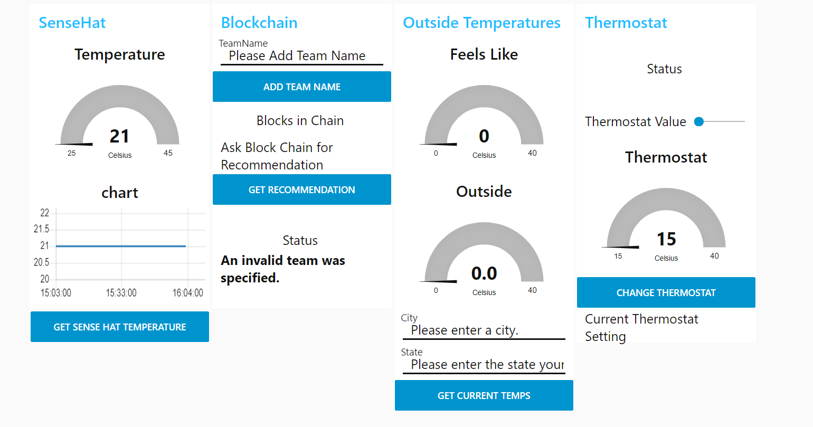
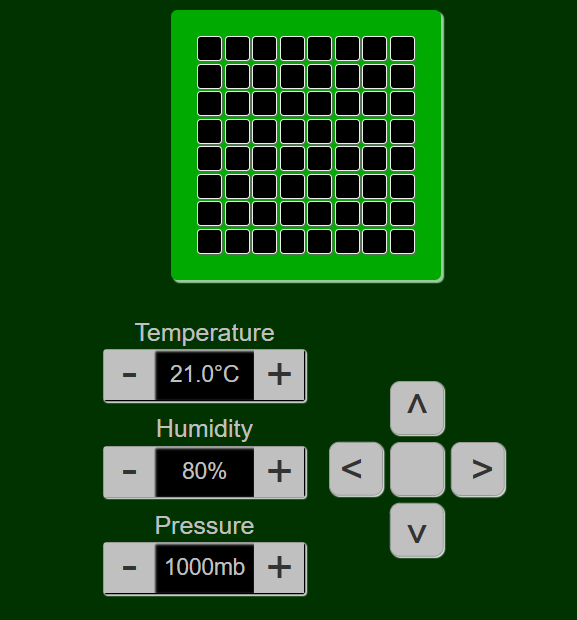

# IBMBlockChain

## 任务部署：

#### 准备工作

- [ ] 确定应用场景，分配成员工作

#### 后端代码任务（3人

- [ ] 完成在fabric环境中运行的代码，主要有类定义(.cto文件)和函数功能(js文件)两部分
- [ ] 测试代码，确定区块链(20分)和智能合约(30分)的实现
- [ ] 完成项目文档，包括详细项目文档和readme文件的书写(20分)

#### 前端界面与串联（2人

- [ ] 在node-red中编辑节点设计ui界面，至少要完成仪表盘的制作(15分)

- [ ] 目前还不完全确定node-red的使用方法，下面这个模拟器很可能是自动实现的。若非如此，我们将根据工作进度决定是否实现此功能

  

  

  #### 最终审核

  - [ ] 制作简单的ppt,进行成果展示，应对最终的答辩

  

